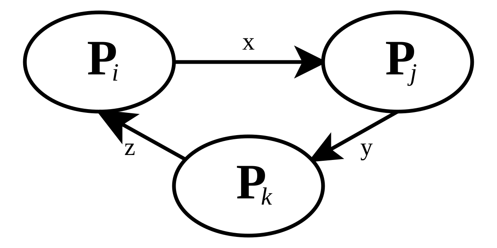

# LockX - Automated Deadlock Detection Tool

## 📌 Project Overview  

**LockX** is a **real-time Automated Deadlock Detection System** designed for monitoring and analyzing system processes. It detects potential **deadlocks in background processes** by applying **graph-based algorithms** to identify cycles in **resource allocation graphs (RAGs)**.  

This tool is especially useful for **operating system research**, **process synchronization analysis**, and **debugging system performance issues** caused by deadlocks.  

---

## 🛠 Functionalities & Features  

### ✅ Live System Monitoring  
- Continuously fetches **background processes** from the system.  
- Displays running processes dynamically.  

### ✅ Deadlock Detection (Graph-Based)  
- Uses **Wait-For Graph (WFG) construction**.  
- **Cycle detection using Depth-First Search (DFS)**.  
- Highlights **deadlocked processes in red** in the GUI.  

### ✅ Automated Logging  
- Logs deadlock occurrences in `logs/deadlocks.log`.  
- Stores **timestamps, process IDs, and resource dependencies**.  

### ✅ Graphical User Interface (GUI)  
- Displays **active processes** in a table.  
- **Real-time updates** for process changes.  
- Deadlocks are **visibly marked in red**.  
- **Sorting & Search**:  
  - Users can **filter** by process name or ID.  
  - **Sort** by CPU, Memory, or PID.  

### ✅ Performance Optimizations  
- **Multi-threading** to ensure GUI **does not freeze** while detecting deadlocks.  
- **Efficient graph algorithms** reduce overhead.  

---

## 🔍 Understanding Deadlocks  

A **deadlock** occurs when a set of processes are permanently blocked, each waiting for a resource held by another in a **circular dependency**.  

### 📌 Four Conditions for Deadlocks (Coffman’s Conditions)  
1. **Mutual Exclusion**: A resource can only be held by one process at a time.  
2. **Hold and Wait**: A process holding resources is waiting for additional resources held by others.  
3. **No Preemption**: Resources cannot be forcibly taken from a process.  
4. **Circular Wait**: A circular chain of processes exists, where each process waits for a resource held by the next.  

A **cycle in the Wait-For Graph (WFG)** confirms a **deadlock condition**.  

---

## ⚙️ Algorithms Used in LockX  

### **1️⃣ Process Monitoring**  
- Uses **Python’s psutil** library to fetch system processes.  
- Extracts **PID, memory usage, CPU usage, and open resources**.  
- Stores process-resource mapping in `system_state.json`.  

### **2️⃣ Wait-For Graph (WFG) Construction**  
- Constructs a **directed graph (V, E)**:  
  - **Nodes (V)**: Processes.  
  - **Edges (E)**: Dependencies (if Process A waits for a resource held by Process B).  


### **3️⃣ Deadlock Detection (Cycle Detection in Graph)**  
- **Depth-First Search (DFS) Algorithm** is applied on WFG.  
- If a cycle is detected → **Deadlock occurs**.  
- If no cycle → **System is safe**.  

## 🚀 How to Run LockX  

### 1️⃣ Install Dependencies  
Ensure you have Python **3.8+** installed, then install the required libraries:  

```bash
pip install psutil tkinter ttkthemes
```

### 2️⃣ Clone the Repository
Clone the LockX repository from GitHub and navigate to the project folder:

```bash
git clone https://github.com/BenGJ10/LockX-Automated-Deadlock-Detection-Tool.git
cd LockX-Automated-Deadlock-Detection-Tool
```

### 3️⃣ Run the file
Execute the following command to launch LockX interface:

```bash
python main.py
```

## 📸 Screenshots


---

## 🤝 Contributors
- Ben Gregory John
- Pooja Dheeraj Sindhu
- Aleena Rose 

## 📜 License
This project is licensed under the MIT License – see the LICENSE file for details.